---
## Front matter
lang: ru-RU
title: 2 этапа внешних курсов
subtitle: Работа на сервере
author:
  - Барето Вилиан Мануел

## Formatting pdf
toc: false
toc-title: Содержание
slide_level: 2
aspectratio: 169
section-titles: true
theme: metropolis
header-includes:
 - \metroset{progressbar=frametitle,sectionpage=progressbar,numbering=fraction}
---

# Цель работы

Ознакомиться с функционалом операционной системы Linux.

# Задание

Просмотреть видео и на основе полученной информации пройти тестовые задания.

# Выполнение лабораторной работы

2 Этап: 

{#fig:001 width=70%}

# Выполнение лабораторной работы

Удаленный сервер - это компьютер, находящийся в дата-центре, к которому можно получить удаленный доступ через сеть Интернет. 

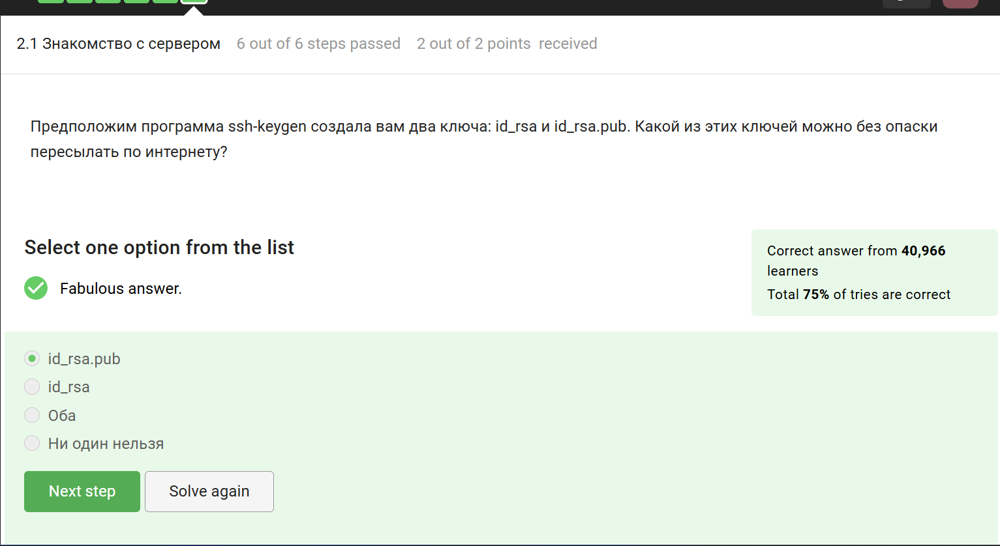{#fig:002 width=70%}

# Выполнение лабораторной работы

Только id_rsa.pub, так как он является открытым.

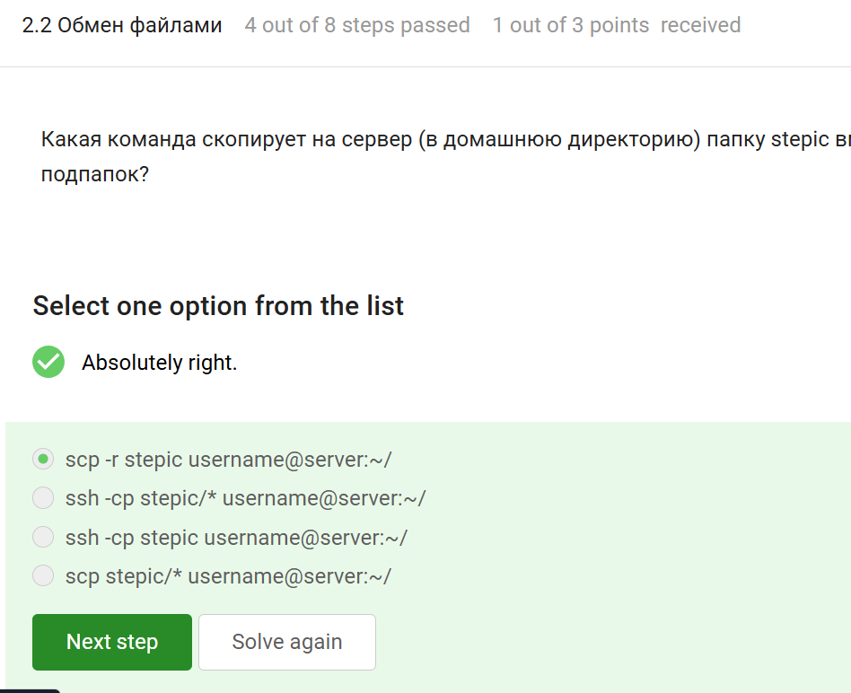{#fig:003 width=70%}

# Выполнение лабораторной работы

-r = Recursively copy entire directories. Note that scp follows symbolic links encountered in the tree traversal.

{#fig:004 width=70%}

# Выполнение лабораторной работы

Проверяем интернет соединение на предмет того, что устройство не может соединиться с сервером, затем проверяем то, знает ли оно вообще о существовании такой программы.

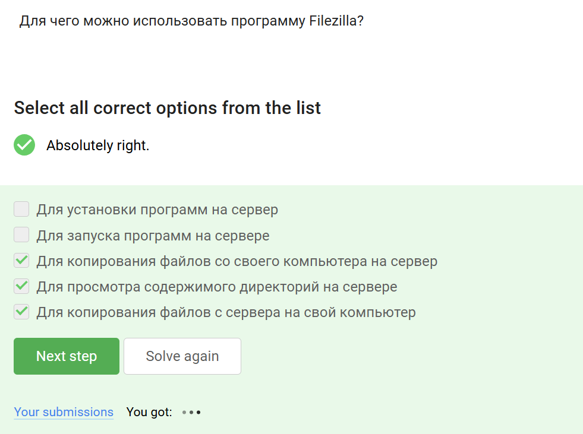{#fig:005 width=70%}

# Выполнение лабораторной работы

FileZilla — свободный многоязычный проект, посвящённый приложениям для FTP. 

{#fig:006 width=70%}

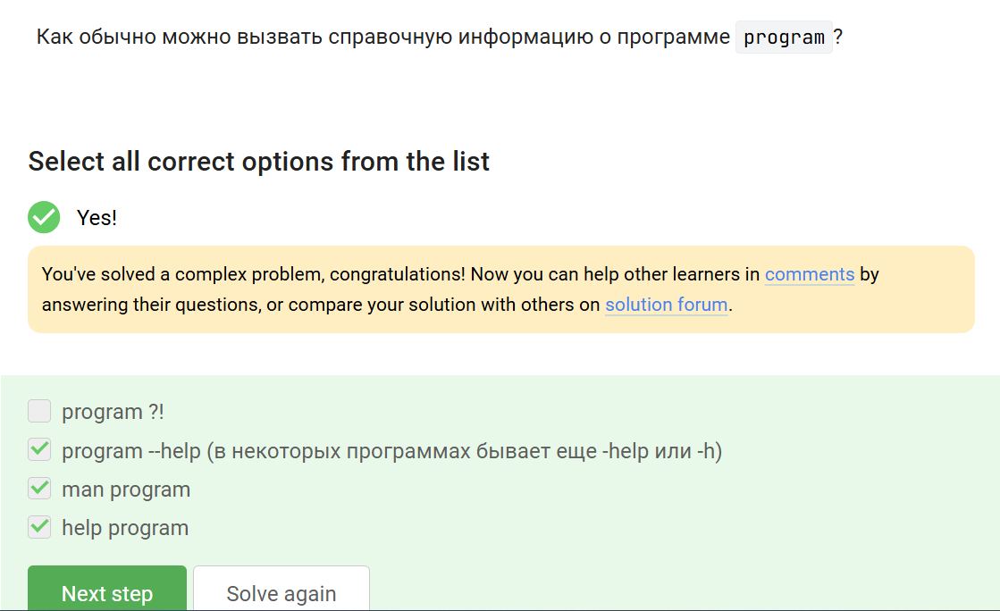{#fig:007 width=70%}

# Выполнение лабораторной работы

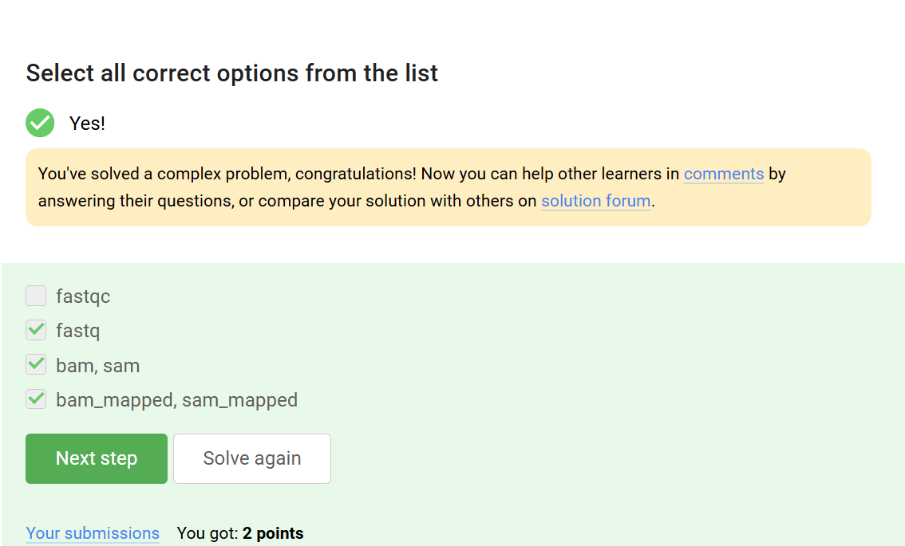{#fig:008 width=70%}

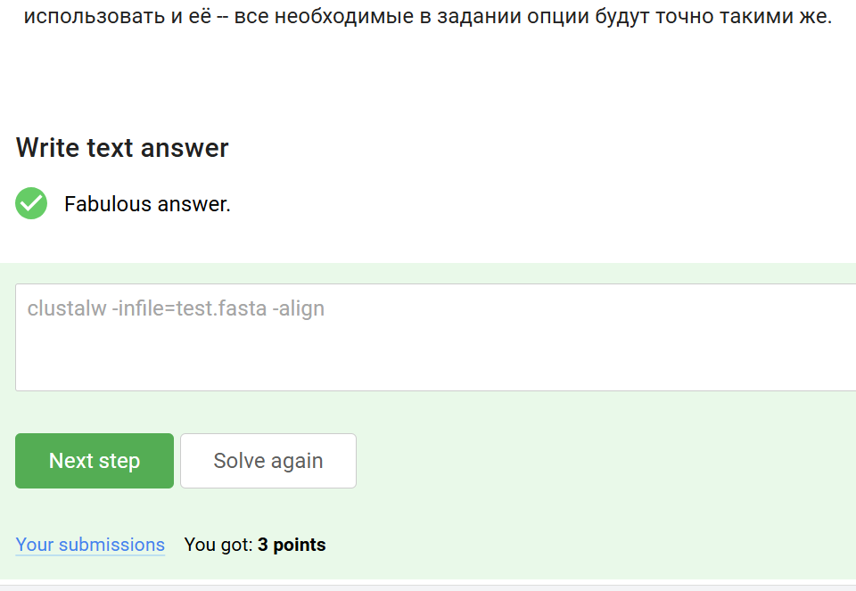{#fig:009 width=70%}

-align
Do full multiple alignment.

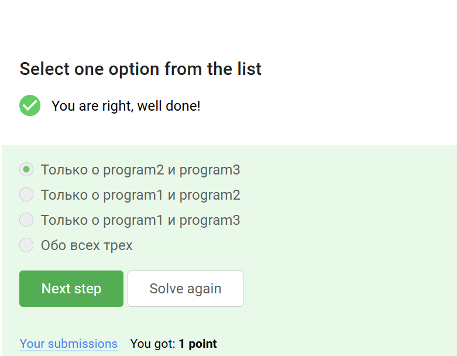{#fig:010 width=70%}

# Выполнение лабораторной работы

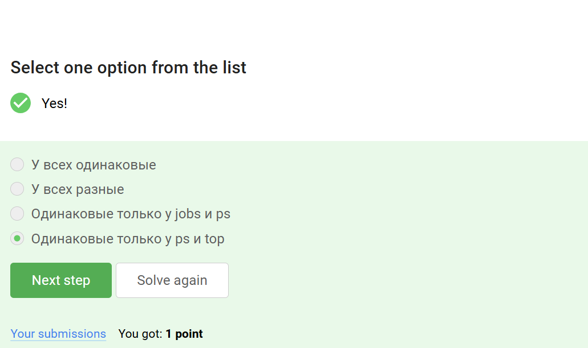{#fig:011 width=70%}

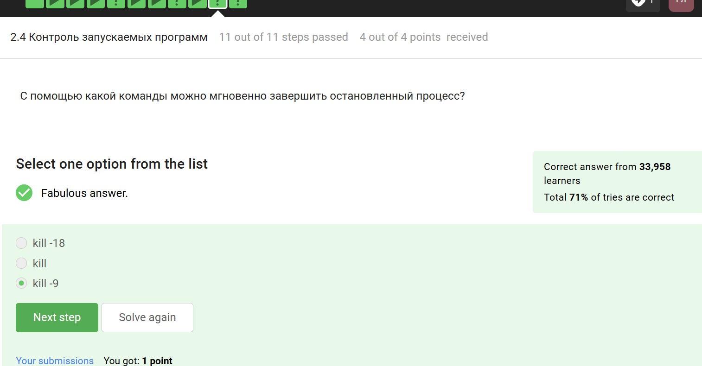{#fig:012 width=70%}

# Выполнение лабораторной работы

Если сигнал не перехватывается процессом, процесс уничтожается. 

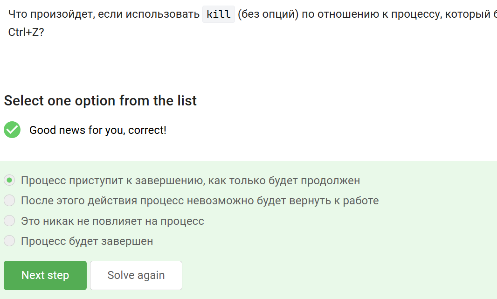{#fig:013 width=70%}

# Выполнение лабораторной работы

Запущенная программа потребляет ресурсы CPU, а остановленная нет.

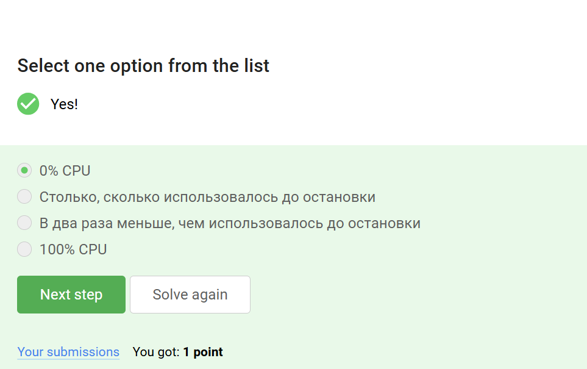{#fig:015 width=70%}

# Выполнение лабораторной работы

Приостановленное приложение не выполняет новых действий, поэтому не занимает вычислительные ресурсы компьютера (CPU 0%). 

{#fig:016 width=70%}

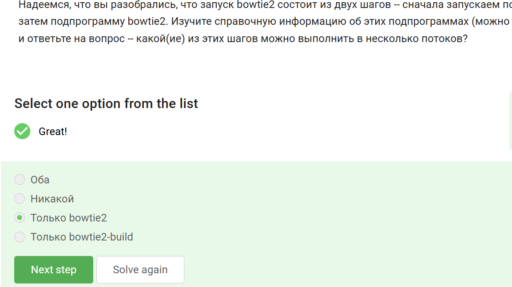{#fig:017 width=70%}

# Выполнение лабораторной работы

{#fig:018 width=70%}

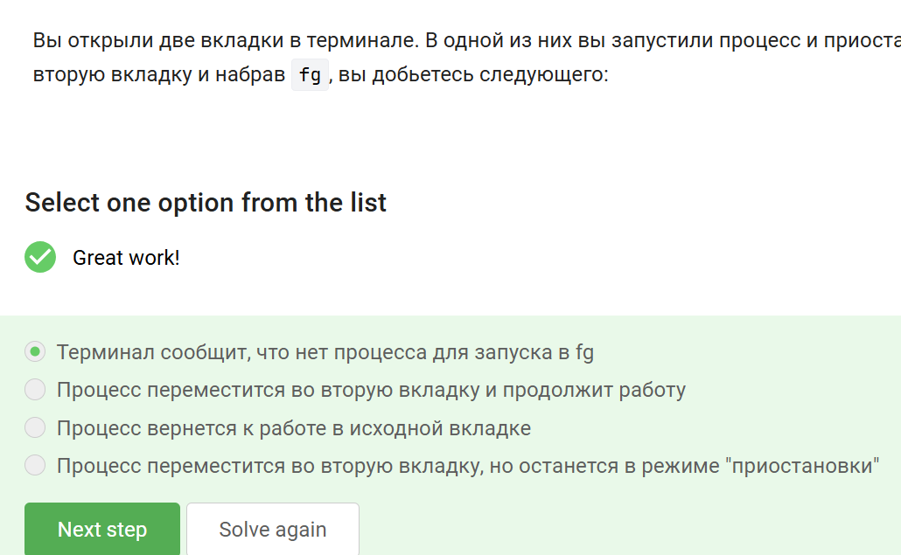{#fig:019 width=70%}

# Выполнение лабораторной работы

{#fig:020 width=70%}

exit завершает работу tmux

{#fig:021 width=70%}

# Выполнение лабораторной работы

Мы заходили на сервер с терминала, который и закрыли, а tmux будет продолжать свою работу на сервере.

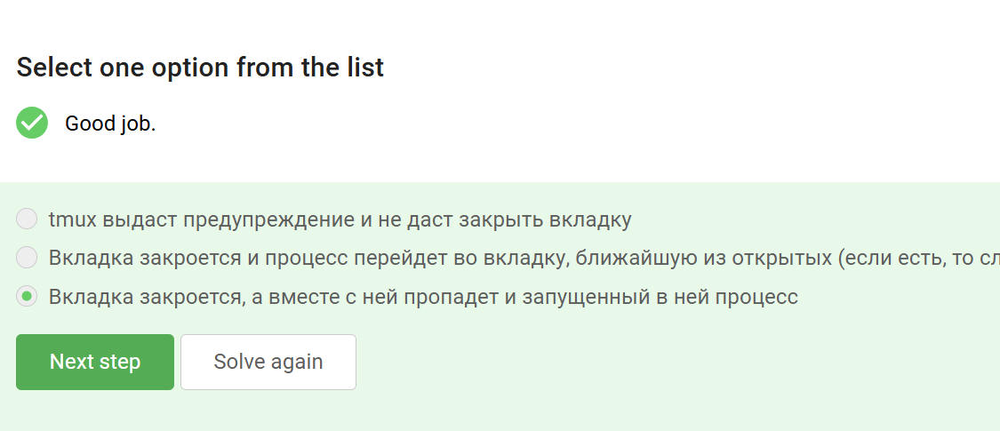{#fig:022 width=70%}

# Выполнение лабораторной работы

Ещё будет предупреждение о том, что работа завершится. Запущенный процесс во вкладке, конечно же, при её закрытии, пропадёт.

{#fig:023 width=70%}

# Выполнение лабораторной работы

Ctrl+b c - создать новое окно;

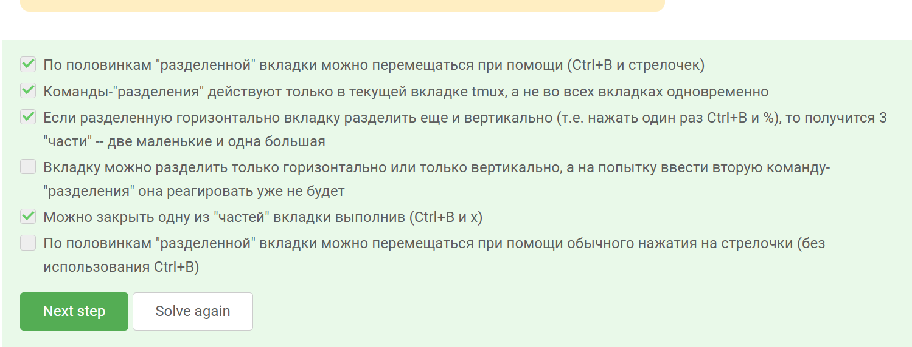{#fig:024 width=70%}

Можно закрыть одно из делений вкладки выполнив команды Ctrl+B и Х.

# Выводы

Я просмотрела курс и освежила в памяти навыки работы с более сложными командами в Линукс.

# Список литературы{.unnumbered}

::: {#refs}
:::

