---
## Front matter
lang: ru-RU
title: Презентация по лабораторной работе №9
subtitle: Командная оболочка Midnight Commander
author:
  - Барето Вилиан Мануел
institute:
  - Российский университет дружбы народов, Москва, Россия
date: 10 Апреля 2025

## i18n babel
babel-lang: russian
babel-otherlangs: english

## Formatting pdf
toc: false
toc-title: Содержание
slide_level: 2
aspectratio: 169
section-titles: true
theme: metropolis
header-includes:
 - \metroset{progressbar=frametitle,sectionpage=progressbar,numbering=fraction}
 - '\makeatletter'
 - '\beamer@ignorenonframefalse'
 - '\makeatother'
---

# Информация

## Докладчик

:::::::::::::: {.columns align=center}
::: {.column width="60%"}

  * Барето Вилиан Мануел
  * Студент НКА 03-24
  * Факультет физико-математических и естественных наук
  * Российский университет дружбы народов
  * [1032239248@pfur.ru](mailto:1032239248@pfur.ru)
  * https://github.com/WMBarreto/study_2024-2025_os-intro.git

:::
::: {.column width="30%"}
:::
::::::::::::::

# Задание по mc

Я запускала mc, изучала его структуру и меню:

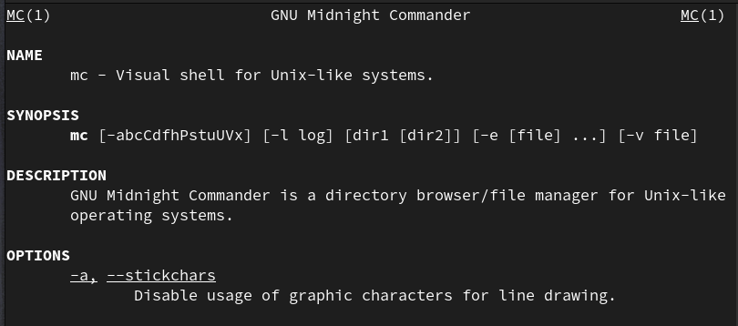{#fig:001 width=60%}

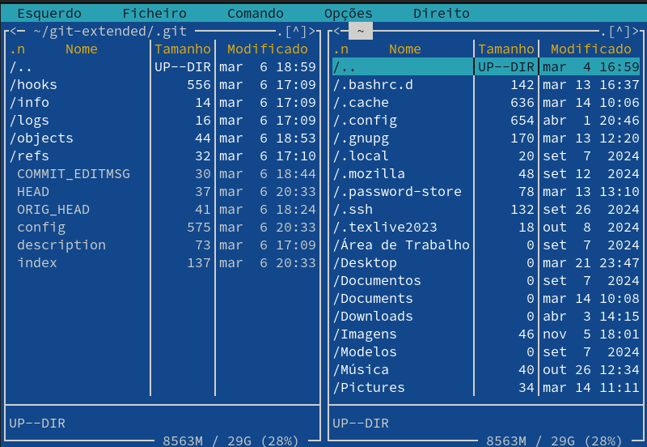{#fig:002 width=60%}

## Задание по mc

 Используя управляющие клавиши я; скопировала файл README.md в домашний каталог:

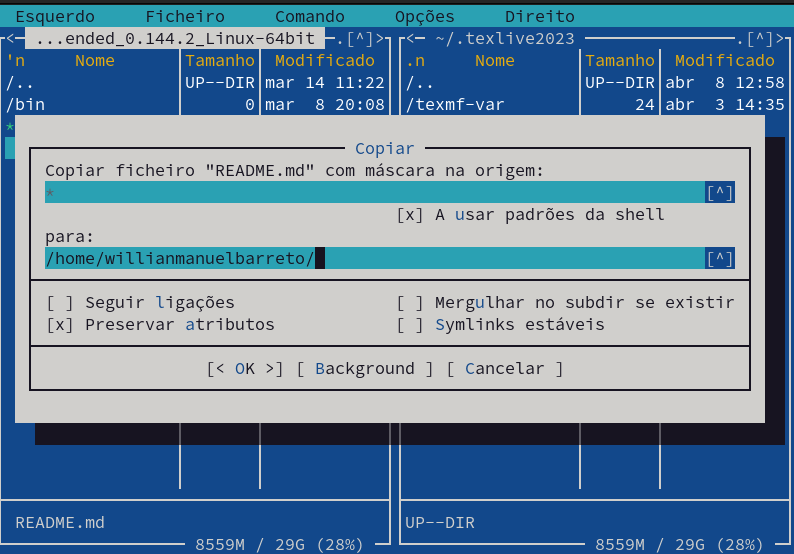{#fig:003 width=60%}

## Задание по mc

Создала файл new в ~/work/blog и удалила его: 

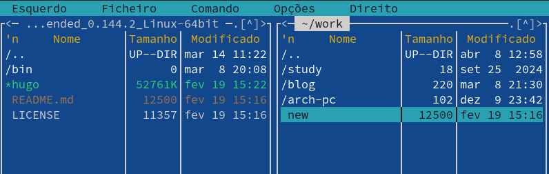{#fig:004 width=60%}

## Задание по mc

{#fig:005 width=60%}

## Задание по mc

Получила информацию о размере и правах доступа на файл README.md:

{#fig:006 width=60%}

## Задание по mc

В правой панели вывела информацию о файле. При этом я получаю больше информации чем в выводе ls:

{#fig:007 width=60%}

## Задание по mc

Используя возможности подменю Файл; я посмотрела содержаемые текстового файла:

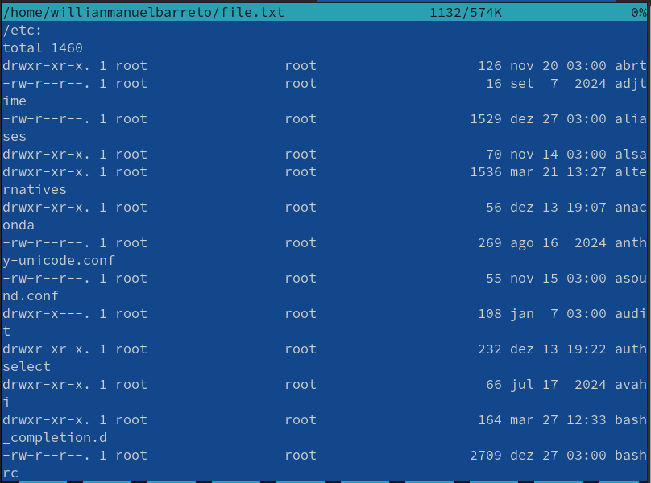{#fig:008 width=60%}

## Задание по mc

редактировала содержаемые текстового файла (abrt на mi): 

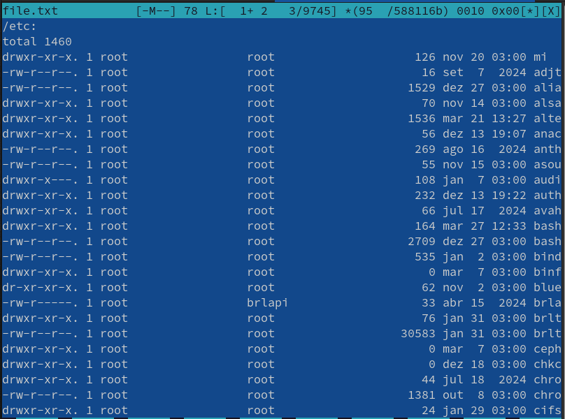{#fig:009 width=60%}

## Задание по mc

Создала новый каталог:

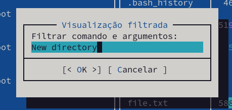{#fig:0010 width=60%}

## Задание по mc

и скопировала файл в ,только что созданный каталог:

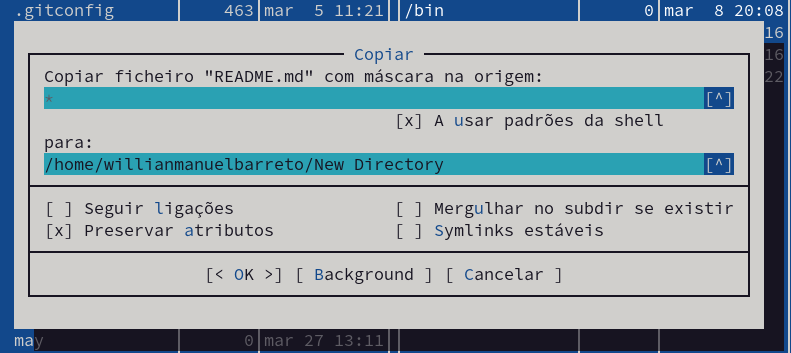{#fig:0011 width=60%}

## Задание по mc

С помощью подменю команда можно найти в файловой системе файл с заданными условиями:

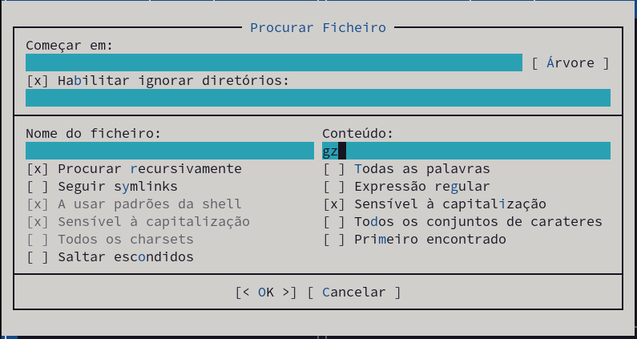{#fig:0012 width=60%}

## Задание по mc

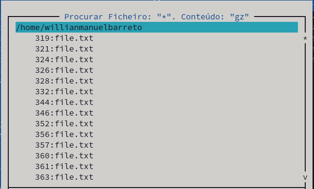{#fig:0013 width=60%}

## Задание по mc

Исользуя подменю команда я повторила одну из предыдущих команд:

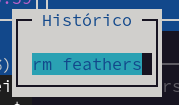{#fig:0014 width=60%}

## Задание по mc

Также перешла в домашний каталог и анализировала файл меню и файл расширения:

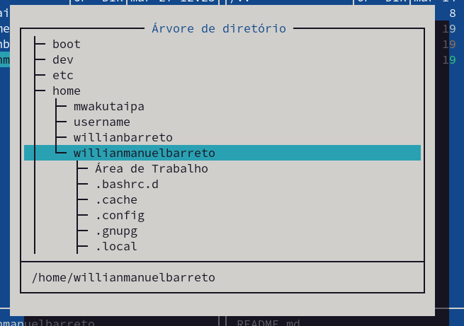{#fig:0015 width=60%}

## Задание по mc

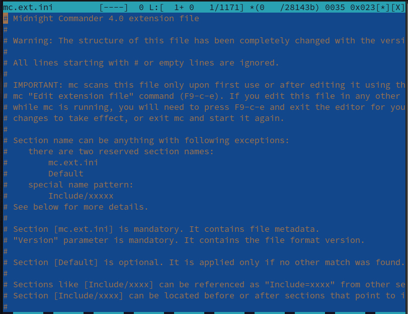{#fig:0016 width=60%}

## Задание по mc

Из подменю настройка вызвала окна настройки панели:

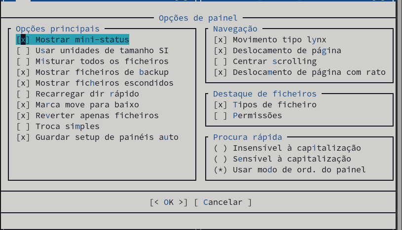{#fig:0017 width=60%}

## Задание по mc

Настройки внешнего вида:

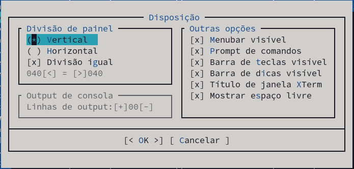{#fig:0018 width=60%}

# Задание по встроенному редактору mc

С помощью команды touch создала text.txt:

{#fig:0019 width=60%}

## Задание по встроенному редактору mc

Далее открыла его для редактирования с помощью f4 и с shift ctrl ins вставила текст:

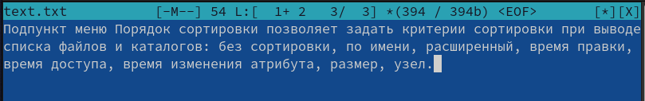{#fig:0020 width=60%}

## Задание по встроенному редактору mc

С помощью f3 выделила текст и удалила выделеные слова f8:

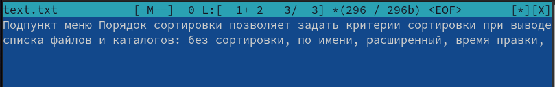{#fig:0021 width=60%}

## Задание по встроенному редактору mc

Перемещала выделенный текст с помощью f6:

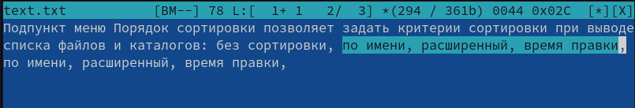{#fig:0022 width=60%}

## Задание по встроенному редактору mc

Сохранила изменении с помощью f2:

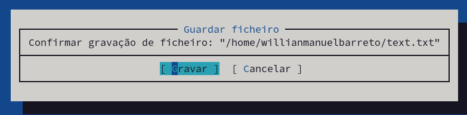{#fig:0023 width=60%}

## Задание по встроенному редактору mc

С помощью ctrl-u отменила последнее действие:

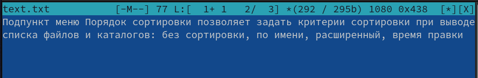{#fig:0024 width=60%}

## Задание по встроенному редактору mc

Используя pg up и pg dn перешла в начало и конец файла и написала некоторый текст. Затем сохранила и закрыла файл:

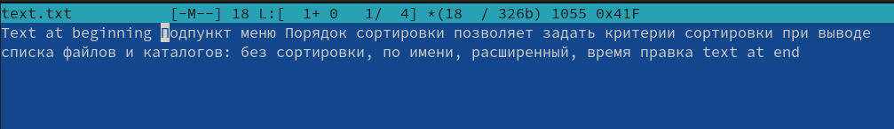{#fig:0025 width=60%}

## Задание по встроенному редактору mc

Открыла файл с исходным текстом на cpp:

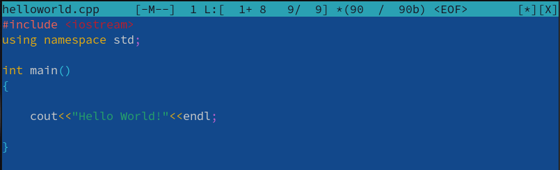{#fig:0026 width=60%}

## Задание по встроенному редактору mc

Используя подменю команда я выключила подсветку синтаксиса:

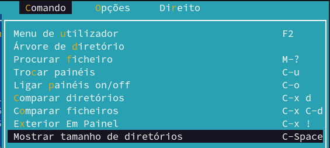{#fig:0027 width=60%}

## Задание по встроенному редактору mc

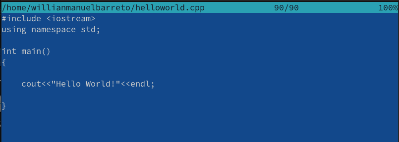{#fig:0028 width=60%}

